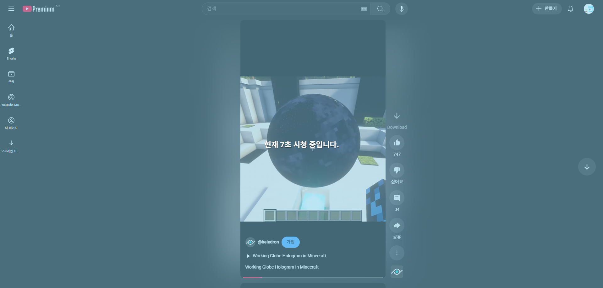

(제미나이로 10초만에 생성한 확장 프로그램, 개발 편하다 ㅇㄱㅇ)

# YouTube Shorts 시청 시간 알리미 (YouTube Shorts Watch Time Notifier)
> YouTube Shorts를 시청할 때 화면에 경과 시간을 표시하여 시청 시간을 인지하도록 돕는 간단한 크롬 확장 프로그램입니다.

## ✨ 주요 기능

* **실시간 시간 추적**: YouTube Shorts 페이지에 접속한 순간부터 시청 시간을 초 단위로 추적하여 표시합니다.
* **자동 단위 변경**: 60초가 지나면 '분:초' 단위로, 60분이 지나면 '시:분:초' 단위로 자동 변경되어 표시됩니다.
* **시각적 알림**: 화면 전체를 덮는 반투명 하늘색 오버레이 위에 굵은 흰색 글씨로 시간을 명확하게 보여줍니다.
* **URL 기반 작동**: 주소에 `/shorts`가 포함된 YouTube 페이지에서만 자동으로 활성화됩니다.

## 🖼️ 스크린샷 (예시)

## 🛠️ 설치 방법

1.  **저장소 다운로드**:
    * 이 GitHub 저장소의 코드를 ZIP 파일로 다운로드한 후 압축을 해제합니다.

2.  **크롬 확장 프로그램 페이지 열기**:
    * 크롬 브라우저를 열고 주소창에 `chrome://extensions`를 입력하여 확장 프로그램 관리 페이지로 이동합니다.
    * 또는 크롬 메뉴(점 3개 아이콘) > 확장 프로그램 > 확장 프로그램 관리 로 이동합니다.

3.  **개발자 모드 활성화**:
    * 확장 프로그램 관리 페이지 오른쪽 상단에 있는 '개발자 모드' 토글 스위치를 켭니다.

4.  **확장 프로그램 로드**:
    * '압축 해제된 확장 프로그램을 로드합니다.' 버튼을 클릭합니다.
    * 파일 탐색기가 열리면, 1단계에서 압축을 해제했거나 클론한 `shorts-timer` 폴더를 선택하고 '폴더 선택' 버튼을 클릭합니다.

5.  **설치 확인**:
    * 확장 프로그램 목록에 'Shorts 시청 시간 알리미'가 추가되고 활성화되었는지 확인합니다.

## 🚀 사용 방법

설치가 완료되면 별도의 조작 없이 YouTube ([youtube.com/shorts/](youtube.com/shorts/))에 접속하여 `/shorts/` 경로의 영상을 시청할 때 자동으로 오버레이와 함께 시청 시간이 표시됩니다. Shorts 페이지를 벗어나면 오버레이는 자동으로 사라집니다.

## 💻 사용 기술

* JavaScript (ES6+)
* Chrome Extension API (Manifest V3, Content Scripts)
* HTML / CSS (DOM 조작 및 스타일링)